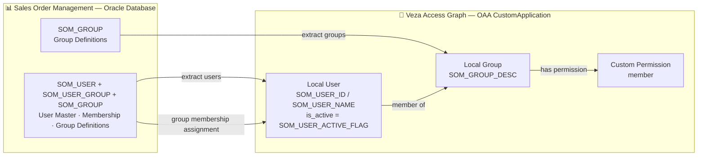

# Sales Order Management → Veza OAA Integration

## Overview

This connector reads identity and group membership data from the **Sales Order Management (SOM)** Oracle database and pushes it into Veza's Access Graph via the Open Authorization API (OAA). Once in Veza, you can query who has access to SOM, what groups they belong to, and whether their accounts are active — all from a single pane of glass.

### Entity Mapping

| Source Table | OAA Entity | Key Fields |
|---|---|---|
| `SOM_USER` | **Local User** | `SOM_USER_ID` (unique ID), `SOM_USER_NAME` (display name), `SOM_USER_ACTIVE_FLAG` (active status) |
| `SOM_GROUP` | **Local Group** | `SOM_GROUP_ID`, `SOM_GROUP_DESC` (display name) |
| `SOM_USER_GROUP` | Membership | Links users → groups |

### OAA Permission Mapping

| Permission | OAA Type | Meaning |
|---|---|---|
| `member` | `DataRead` | User is a member of a SOM group |

---

## Entity Relationship Map



---

## How It Works

1. **Load config** — Read credentials from `.env` (file path overridable via `--env-file`). CLI flags take precedence over environment variables.
2. **Connect to Oracle** — Open a thin-mode connection using `oracledb`. No Oracle Instant Client installation required.
3. **Fetch groups** — Execute `SELECT SOM_GROUP_ID, SOM_GROUP_DESC FROM som_group`.
4. **Fetch user memberships** — Execute the account join query across `SOM_USER`, `SOM_USER_GROUP`, and `SOM_GROUP`.
5. **Build OAA payload** — Construct a `CustomApplication` object with local users, local groups, and group memberships.
6. **Push to Veza** — Call `push_application()` with `create_provider=True`; the provider is created automatically if it does not exist.

---

## Prerequisites

| Requirement | Details |
|---|---|
| **OS** | Linux (RHEL 8+, Ubuntu 20.04+) or macOS (dev/test only) |
| **Python** | 3.9 or higher |
| **Oracle connectivity** | TCP access to the Oracle DB host on its listener port (default 1521) |
| **Veza access** | HTTPS to your Veza tenant; valid API key with OAA write permissions |
| **Oracle Instant Client** | **Not required** — `oracledb` thin mode connects without it |

### Oracle DB permissions

The service account used for `DB_USERNAME` needs at minimum:

```sql
GRANT SELECT ON som_user       TO <service_account>;
GRANT SELECT ON som_user_group TO <service_account>;
GRANT SELECT ON som_group      TO <service_account>;
```

---

## Quick Start

```bash
curl -fsSL https://raw.githubusercontent.com/andrewmusto-git/Sales-Order-Management/main/integrations/sales-order-management/install_sales_order_management.sh | bash
```

For non-interactive / CI installs:

```bash
VEZA_URL=https://company.veza.com \
VEZA_API_KEY=<key> \
DB_URL=hostname:1521/SERVICE_NAME \
DB_USERNAME=som_reader \
DB_PASSWORD=secret \
curl -fsSL https://raw.githubusercontent.com/andrewmusto-git/Sales-Order-Management/main/integrations/sales-order-management/install_sales_order_management.sh \
  | bash -s -- --non-interactive
```

---

## Manual Installation

### RHEL / CentOS / Amazon Linux

```bash
sudo dnf install -y git python3 python3-pip
python3 -m venv venv
source venv/bin/activate
pip install -r requirements.txt
```

### Ubuntu / Debian

```bash
sudo apt-get install -y git python3 python3-venv python3-pip
python3 -m venv venv
source venv/bin/activate
pip install -r requirements.txt
```

### Configure credentials

```bash
cp .env.example .env
chmod 600 .env
nano .env   # fill in DB_URL, DB_USERNAME, DB_PASSWORD, VEZA_URL, VEZA_API_KEY
```

### DB_URL format

| Format | Example |
|---|---|
| EZConnect | `hostname:1521/SERVICE_NAME` |
| JDBC thin (service) | `jdbc:oracle:thin:@//hostname:1521/SERVICE_NAME` |
| JDBC thin (SID) | `jdbc:oracle:thin:@hostname:1521:SID` |

---

## Usage

```bash
./venv/bin/python3 sales_order_management.py [OPTIONS]
```

### CLI Reference

| Argument | Required | Default | Description |
|---|---|---|---|
| `--env-file PATH` | No | `.env` | Path to the credentials file |
| `--veza-url URL` | Yes* | `$VEZA_URL` | Veza tenant URL |
| `--veza-api-key KEY` | Yes* | `$VEZA_API_KEY` | Veza API key |
| `--provider-name NAME` | No | `Sales Order Management` | Provider name in Veza UI |
| `--datasource-name NAME` | No | `SOM` | Datasource name in Veza UI |
| `--db-url URL` | Yes | `$DB_URL` | Oracle connection URL |
| `--db-username USER` | Yes | `$DB_USERNAME` | DB username |
| `--db-password PASS` | Yes | `$DB_PASSWORD` | DB password |
| `--db-driver CLASS` | No | `oracle.jdbc.OracleDriver` | JDBC driver class (informational) |
| `--db-extra JSON` | No | — | Extra oracledb kwargs as JSON |
| `--dry-run` | No | `false` | Build payload only; skip Veza push |
| `--save-json PATH` | No | *(auto with --dry-run)* | Save OAA payload JSON to file |
| `--log-level LEVEL` | No | `INFO` | `DEBUG`, `INFO`, `WARNING`, `ERROR` |

*\* Required unless `--dry-run` is specified.*

### Examples

```bash
# Dry run — build payload, save JSON, no Veza push
./venv/bin/python3 sales_order_management.py --dry-run

# Live push using .env file
./venv/bin/python3 sales_order_management.py --env-file .env

# Debug mode with explicit credentials
./venv/bin/python3 sales_order_management.py \
  --veza-url https://company.veza.com \
  --veza-api-key $VEZA_API_KEY \
  --db-url hostname:1521/ORCL \
  --db-username som_reader \
  --db-password secret \
  --log-level DEBUG

# Override provider/datasource names
./venv/bin/python3 sales_order_management.py \
  --env-file .env \
  --provider-name "SOM Production" \
  --datasource-name "SOM-PROD"
```

---

## Deployment on Linux

### Create a dedicated service account

```bash
sudo useradd -r -s /bin/bash -m -d /opt/sales-order-management-veza som-veza
sudo chown -R som-veza:som-veza /opt/VEZA/sales-order-management-veza
sudo chmod 700 /opt/VEZA/sales-order-management-veza/scripts
sudo chmod 600 /opt/VEZA/sales-order-management-veza/scripts/.env
```

### SELinux (RHEL only)

```bash
getenforce
sudo restorecon -Rv /opt/VEZA/sales-order-management-veza/
```

### Cron wrapper script

Create `/opt/VEZA/sales-order-management-veza/run_som_oaa.sh`:

```bash
#!/usr/bin/env bash
set -euo pipefail
SCRIPT_DIR="/opt/VEZA/sales-order-management-veza/scripts"
cd "${SCRIPT_DIR}"
./venv/bin/python3 sales_order_management.py --env-file .env
```

```bash
chmod +x /opt/VEZA/sales-order-management-veza/run_som_oaa.sh
```

### Schedule with cron (`/etc/cron.d/som-veza`)

```cron
# Run Sales Order Management → Veza sync every 4 hours
0 */4 * * * som-veza /opt/VEZA/sales-order-management-veza/run_som_oaa.sh >> /opt/VEZA/sales-order-management-veza/logs/cron.log 2>&1
```

### Log rotation (`/etc/logrotate.d/som-veza`)

```
/opt/VEZA/sales-order-management-veza/logs/*.log {
    daily
    rotate 14
    compress
    missingok
    notifempty
    create 640 som-veza som-veza
}
```

---

## Multiple Instances

To run the connector against multiple SOM environments (e.g., production and UAT):

```bash
# Production
./venv/bin/python3 sales_order_management.py \
  --env-file .env.prod \
  --datasource-name SOM-PROD

# UAT
./venv/bin/python3 sales_order_management.py \
  --env-file .env.uat \
  --datasource-name SOM-UAT
```

Stagger cron schedules by 15–30 minutes to avoid simultaneous DB load.

---

## Security Considerations

- The `.env` file must be `chmod 600` and owned by the service account only.
- Never commit `.env` to version control — `.env.example` contains only placeholders.
- The DB service account (`DB_USERNAME`) should be read-only. Grant only `SELECT` on the three SOM tables.
- Rotate `VEZA_API_KEY` and `DB_PASSWORD` on your organization's standard schedule.
- `oracledb` thin mode transmits credentials over the Oracle Net protocol. Enable Oracle Net encryption (NNE/TLS) for production deployments.
- Review SELinux/AppArmor policies if the script cannot write to the `logs/` directory.

---

## Troubleshooting

| Symptom | Cause | Fix |
|---|---|---|
| `ERROR: oracledb package not installed` | Missing dependency | Run `./venv/bin/pip install oracledb` |
| `Oracle connection failed: ORA-12541` | No listener on DB host/port | Verify `DB_URL` host and port; check firewall |
| `Oracle connection failed: ORA-01017` | Invalid credentials | Check `DB_USERNAME` / `DB_PASSWORD` in `.env` |
| `Oracle connection failed: ORA-12154` | Unresolvable service name | Use IP address or check DNS/tnsnames.ora |
| `Missing required database configuration` | Env vars not loaded | Confirm `.env` exists at `--env-file` path |
| `Veza push failed: HTTP 401` | Invalid API key | Regenerate API key in Veza Settings |
| `Veza push failed: HTTP 403` | Insufficient permissions | Ensure API key has OAA write access in Veza |
| No users in Veza | Empty join result | Confirm `SOM_USER_GROUP` has rows; run account query manually |
| `Could not assign user X to group Y` | Group name mismatch | Ensure group names from both queries are consistent |
| Log files not created | `logs/` not writable | Run `mkdir -p logs && chmod 775 logs` |

Enable debug logging for verbose output:

```bash
./venv/bin/python3 sales_order_management.py --env-file .env --log-level DEBUG
```

---

## Changelog

| Version | Date | Notes |
|---|---|---|
| 1.0 | 2026-05-08 | Initial release — accounts, groups, membership from Oracle via oracledb thin mode |
